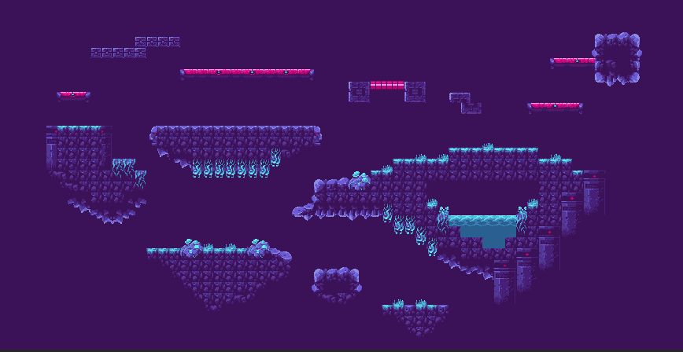

# Overview

For the past couple of weeks I have been working with a small team of game developers to create a multi player fighting game using Unity. We have been making some real progress and hope to publish our game on steam in the next month. To help with this project I have been tasked to create more maps for our game and with the work I have done this we now have six maps for our players to select and play on.

I was able to rebuild one of our old maps and build 2 completely new maps with one additional maps in the works.

Cave (Done)

Nirmata-Hidden (Done)

DonkyKong (Done)

## Other Maps Created

NewYork (Done)

Earth (Done)

Gold (Done)

[Maps Demo Video](https://youtu.be/7xE7kr6U5ns)

# Development Environment

I created all of these maps in unity piece by piece and layer by layer.

# Useful Websites

{Make a list of websites that you found helpful in this project}

- [Setting up tile maps video](https://www.youtube.com/watch?v=g83_gwEO0kM)
- [Unity asset store](https://assetstore.unity.com/)

# Future Work

- I want to finish the NewYork Map
- I desperately want to make new items for the players to interact with
- I want to help with the camera code to better use the maps
- I want to create better backgrounds for the maps